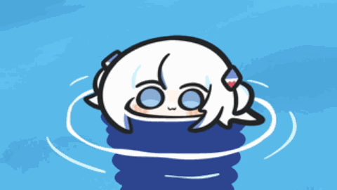
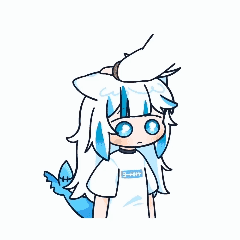
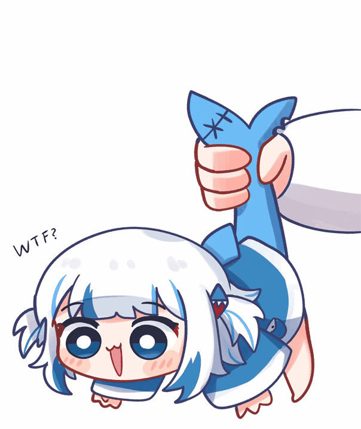
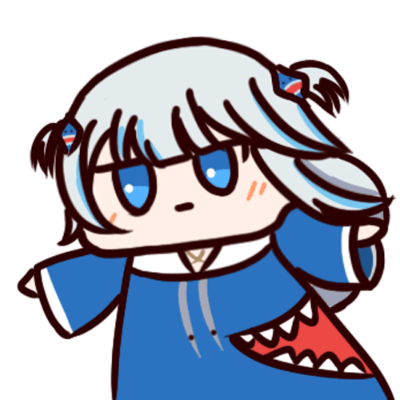
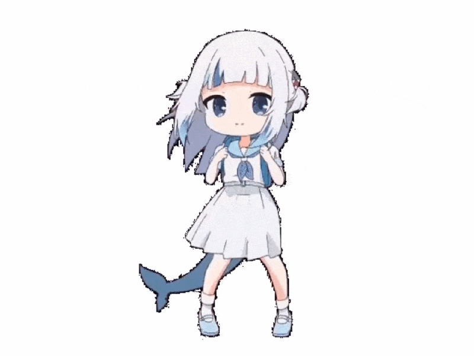
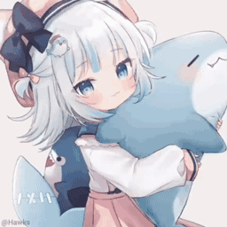
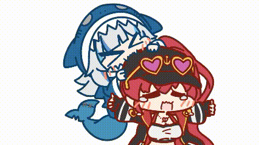

# A！！！我是一只鲨鱼！

  
  
  

<table>
  <tr>
    <td width="70%">
      
    </td>
    <td align="center">
      
       
      <strong>我只是抄过来的没想到有这么多东西啊！</strong>
    </td>
  </tr>
</table>

 

## 亚特兰蒂斯档案

<table>
  <tr>
    <td align="center" width="24%">
      
       
      <strong>浅蓝海域常驻鲨鱼</strong>
    </td>
    <td width="52%">
      

        <strong>身份标签：</strong>
        
        
        
        
      

      
<strong>当前在做什么：</strong>想到什么就做什么awa

      
<strong>想展示的项目：</strong>无

      
<strong>喜欢的关键词：</strong>大白鲨、锤头鲨、鲸鲨、虎鲨、柠檬鲨、护士鲨、长尾鲨、睡鲨、姥鲨、达摩鲨

      
<strong>座右铭：</strong>亚特兰蒂斯最会写代码的鲨鱼！

    </td>
    <td align="center" width="24%">
      
       
      
    </td>
  </tr>
</table>

 

## 离谱入学经历

<table>
  <tr>
    <th>阶段</th>
    <th>学校</th>
    <th>入学理由</th>
    <th>毕业状态</th>
  </tr>
  <tr>
    <td>幼儿园</td>
    <td>海绵宝宝菠萝屋幼儿园</td>
    <td>因为离海很近，适合鲨鲨通勤</td>
    <td>学会了冒头</td>
  </tr>
  <tr>
    <td>小学</td>
    <td>家里蹲第一小学</td>
    <td>主修睡觉头像与纸箱潜伏</td>
    <td>全勤失败，但很快乐</td>
  </tr>
  <tr>
    <td>初中</td>
    <td>霍格沃兹魔法学院附属水产班</td>
    <td>试图学习把 bug 变没</td>
    <td>魔杖被鲨鲨咬了</td>
  </tr>
  <tr>
    <td>高中</td>
    <td>哥谭市夜间补习学校</td>
    <td>学习如何在深夜写代码</td>
    <td>黑眼圈优秀毕业</td>
  </tr>
  <tr>
    <td>本科</td>
    <td>蓝翔深海挖掘机与 Git 提交学院</td>
    <td>进修把坑挖大再填上的技术</td>
    <td>提交记录开始出现</td>
  </tr>
  <tr>
    <td>研究生</td>
    <td>密斯卡托尼克大学</td>
    <td>研究不可名状的 README 排版</td>
    <td>精神稳定，页面不一定稳定</td>
  </tr>
  <tr>
    <td>博士生</td>
    <td>亚特兰蒂斯国立大学</td>
    <td>研究亚特兰蒂斯最会写代码的鲨鱼为什么会写代码</td>
    <td>论文题目还在水里泡着</td>
  </tr>
</table>

 

 

## 行为准则

<table>
  <tr>
    <th>准则</th>
    <th>执行结果</th>
  </tr>
  <tr>
    <td>可以摸头</td>
    <td>鲨鲨会短暂进入乖巧模式</td>
  </tr>
  <tr>
    <td>不要戳太用力</td>
    <td>鲨鲨会当场应激</td>
  </tr>
  <tr>
    <td>不要拽尾巴</td>
    <td>鲨鲨会开始随机摇晃</td>
  </tr>
  <tr>
    <td>可以投喂</td>
    <td>寿司、巧克力、星星都可以</td>
  </tr>
  <tr>
    <td>遇到 bug</td>
    <td>先装傻，再祈祷，最后想到什么就做什么awa</td>
  </tr>
</table>

 

## 摸摸许可证

摸头可以，戳一下会应激，抓尾巴会开始随机摇晃。

 
 

 

## 今日悬挂公告

 

被挂起来了，但还在营业。

 

## 海底

 
 

 

## 投喂与收纳

 

## 目前掌握的技能

<table>
  <tr>
    <th>技能</th>
    <th>熟练度</th>
    <th>备注</th>
  </tr>
  <tr>
    <td>冒头</td>
    <td>很熟</td>
    <td>从纸箱、杯子、海里都能冒</td>
  </tr>
  <tr>
    <td>转圈</td>
    <td>很熟</td>
    <td>转完继续写代码</td>
  </tr>
  <tr>
    <td>摸头接收</td>
    <td>看心情</td>
    <td>开心时可用</td>
  </tr>
  <tr>
    <td>应激反应</td>
    <td>自动触发</td>
    <td>被戳就启动</td>
  </tr>
  <tr>
    <td>顶级猎杀</td>
    <td>自称精通</td>
    <td>证据见下方</td>
  </tr>
</table>

 

 

## 顶级猎杀者展示

 

## 小剧场

<table>
  <tr>
    <th>镜头</th>
    <th>画面</th>
    <th>发生了什么</th>
  </tr>
  <tr>
    <td>第一幕</td>
    <td></td>
    <td>鲨鲨从海里探头，准备营业</td>
  </tr>
  <tr>
    <td>第二幕</td>
    <td></td>
    <td>路过的人类开始摸头</td>
  </tr>
  <tr>
    <td>第三幕</td>
    <td></td>
    <td>戳了一下，鲨鲨应激</td>
  </tr>
  <tr>
    <td>第四幕</td>
    <td></td>
    <td>鲨鲨被挂起来了，还在摇</td>
  </tr>
  <tr>
    <td>第五幕</td>
    <td></td>
    <td>最后开始祈祷不要出 bug</td>
  </tr>
</table>

 

## 祈祷不要出 bug

 

## 深海留言板

<strong>这里没有项目，只有鲨鱼。</strong>

今日状态：想到什么就做什么awa。

如果页面突然变得很热闹，说明鲨鲨又发现了新的图片。

亚特兰蒂斯最会写代码的鲨鱼，正在假装自己很忙。

 

### *「亚特兰蒂斯最会写代码的鲨鱼！」*

