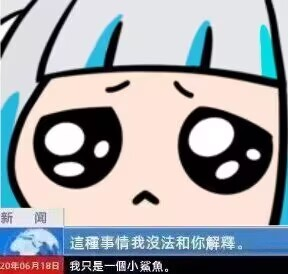
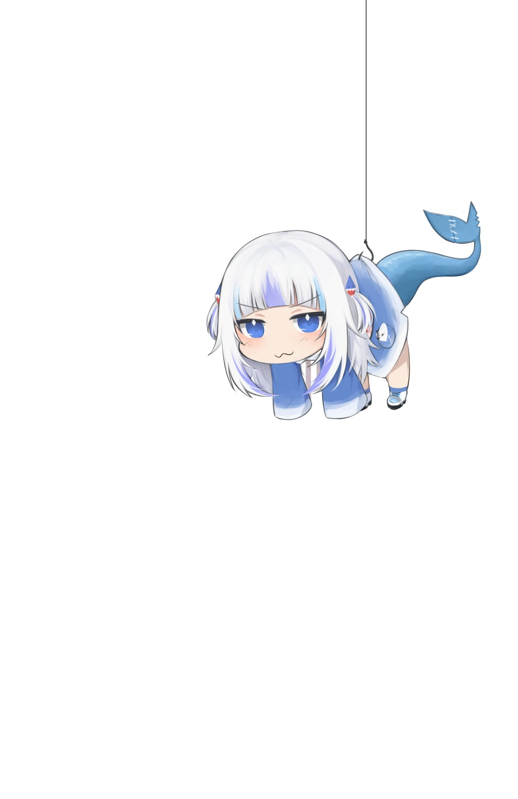
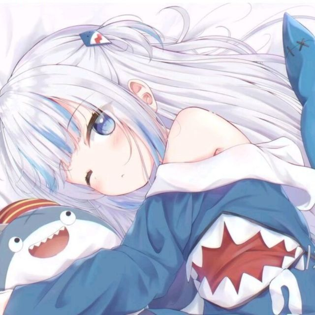
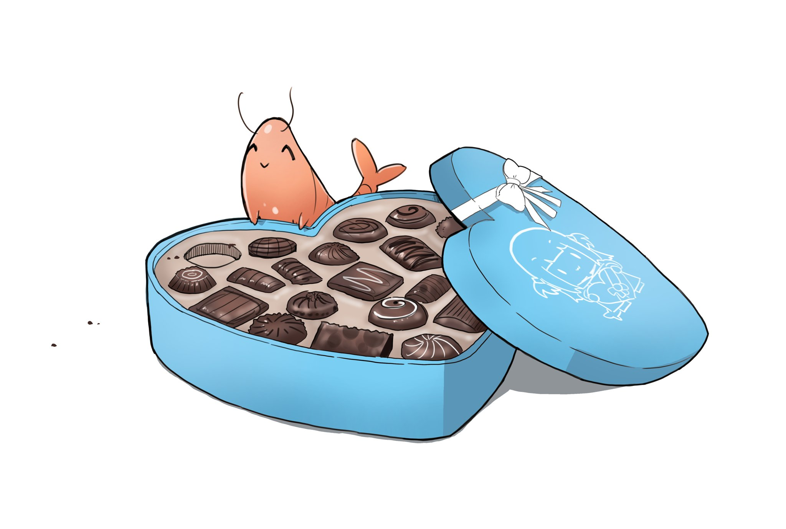

<div align="center">

# 🦈 A！！！我是一只鲨鱼！

<p>
  
  <a href="https://github.com/GuraQwQ?tab=followers">
    
  </a>
  
</p>


<br />

> 我只是抄过来的没想到有这么多东西啊！

</div>

<br />

## 亚特兰蒂斯档案

```typescript
const 鲨鲨 = {
  身份标签: ["shark", "鲨鱼", "鲨鲨", "Gura"],
  当前在做什么: "想到什么就做什么awa",
  想展示的项目: "无",
  喜欢的关键词: [
    "大白鲨",
    "锤头鲨",
    "鲸鲨",
    "虎鲨",
    "柠檬鲨",
    "护士鲨",
    "长尾鲨",
    "睡鲨",
    "姥鲨",
    "达摩鲨",
  ],
  座右铭: "亚特兰蒂斯最会写代码的鲨鱼！",
};
```

<br />

## 鲨鲨

<div align="center">









</div>

<br />

## 🌊 海底

<div align="center">


</div>

<br />

## 继续看鲨鲨

<div align="center">




</div>

<br />

## 还是鲨鲨

<div align="center">


</div>

<br />

<div align="center">

### *「亚特兰蒂斯最会写代码的鲨鱼！」* 🦈


</div>
